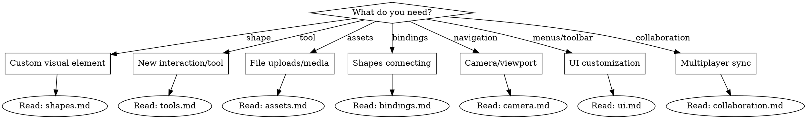

# tldraw SDK

Reference for building collaborative canvas applications with tldraw.

## Overview

tldraw is a React SDK for infinite canvas applications - whiteboards, diagramming tools, collaborative editors, and visual workflow builders.

## How to Use This Skill

This skill provides **reference files** for deep dives into specific domains. Use the navigation table below to find what you need:



## Quick Navigation

| Need | Reference File | Key Topics |
|------|----------------|------------|
| Custom shapes | `shapes.md` | ShapeUtil, geometry, handles, lifecycle hooks, migrations |
| Custom tools | `tools.md` | StateNode, event handlers, state transitions, tool lock |
| Assets (images/video) | `assets.md` | TLAssetStore, upload, resolve, context optimization |
| Shape bindings | `bindings.md` | BindingUtil, lifecycle, isolation vs deletion |
| Camera/zoom | `camera.md` | Constraints, zoomToFit, slideCamera, animations |
| UI customization | `ui.md` | Overrides, toolbar, menus, actions, toasts |
| Multiplayer | `collaboration.md` | TLSocketRoom, presence, following, sync |
| Editor API | `editor-api.md` | Shape ops, camera, selection, export methods |

## Core Pattern: Shape Records + ShapeUtil

```typescript
// Shape record = immutable data in store
const shape: TLGeoShape = {
  id: 'shape1', type: 'geo', typeName: 'shape',
  x: 100, y: 100, rotation: 0, parentId: 'page:page1',
  props: { w: 200, h: 150, geo: 'rectangle' },
}

// ShapeUtil = behavior
class GeoShapeUtil extends ShapeUtil<TLGeoShape> {
  static override type = 'geo'
  getDefaultProps() { return { w: 100, h: 100, geo: 'rectangle' } }
  getGeometry(shape) { return new Rectangle2d({ ... }) }
  component(shape) { return <div/> }
  indicator(shape) { return <rect/> }
}
```

## Core Pattern: Tools as State Machines

```typescript
class StampTool extends StateNode {
  static override id = 'stamp'
  static override initial = 'idle'
  static override children() { return [Idle, Pointing] }
}
// See tools.md for full pattern
```

## Editor API Essentials

```typescript
// Shape CRUD
editor.createShape({ type, x, y, props })
editor.updateShape({ id, ...changes })
editor.deleteShape(id)
editor.getShape(id)

// Camera
editor.setCamera({ x, y, z }, { animation })
editor.zoomToBounds(bounds, { inset, targetZoom })
editor.zoomToFit()

// Selection
editor.select(...ids)
editor.getSelectedShapeIds()
```

## Common Mistakes

| Mistake | Fix |
|---------|-----|
| Forgetting to register ShapeUtil | Pass to `shapeUtils={[MyShapeUtil]}` |
| Geometry doesn't match visual | `getGeometry()` must return accurate bounds |
| Asset URLs not resolving | Implement both `upload()` AND `resolve()` |
| Tool not in toolbar | Add to `overrides.tools()` AND Toolbar component |
| Bindings not updating | Implement `onAfterChangeToShape` or `onAfterChangeFromShape` |

## Security

```typescript
// SVG sanitization for custom handlers
import { sanitizeSvg } from 'tldraw'
const sanitized = sanitizeSvg(svgText)
```

**CSP:**
```
default-src 'self'; script-src 'self'; style-src 'self' 'unsafe-inline';
img-src 'self' data: blob:; object-src 'none'; base-uri 'self';
```

## Related Examples

- [Custom shape](https://github.com/tldraw/tldraw/tree/main/apps/examples/src/examples/shapes/tools/custom-shape)
- [Shape with handles](https://github.com/tldraw/tldraw/tree/main/apps/examples/src/examples/shapes/tools/speech-bubble)
- [Custom tool](https://github.com/tldraw/tldraw/tree/main/apps/examples/src/examples/shapes/tools/custom-tool)
- [Asset options](https://github.com/tldraw/tldraw/tree/main/apps/examples/src/examples/configuration/asset-props)
- [Multiplayer sync](https://github.com/tldraw/tldraw/tree/main/apps/examples/src/examples/sync/multiplayer)
- [Camera constraints](https://github.com/tldraw/tldraw/tree/main/apps/examples/src/examples/configuration/camera-options)
